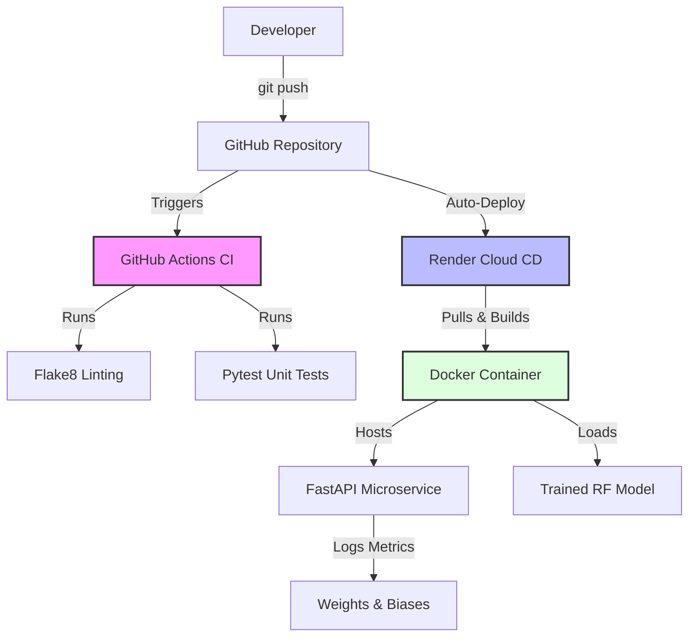

# 🚀 End-to-End MLOps & CI/CD Pipeline: Customer Churn Prediction

[](https://github.com/yaseen002/churn-prediction-mlops/actions/workflows/ci.yml)


[](https://churn-prediction-mlops-b1f0.onrender.com/docs)

An enterprise-grade Machine Learning Operations (MLOps) pipeline that transforms a raw dataset into a production-ready, containerized REST API. This project emphasizes **Systems Engineering** principles, focusing on reproducibility, automated testing, infrastructure as code, and continuous deployment.

🔗 **Live API Documentation:** [https://churn-prediction-mlops-b1f0.onrender.com/docs](https://churn-prediction-mlops-b1f0.onrender.com/docs)

---

## 🏗️ System Architecture

This project implements a robust CI/CD pipeline. Every push to the `main` branch triggers automated quality gates before automatically deploying the updated Docker container to the cloud.


*(Alternatively, view the detailed Draw.io architecture diagram below)*


---

## 🛠️ Tech Stack

*   **Machine Learning:** `scikit-learn` (Random Forest Classifier), `pandas`, `joblib`
*   **Experiment Tracking:** Weights & Biases (W&B)
*   **Backend API:** `FastAPI`, `Pydantic` (Data Validation), `Uvicorn` (ASGI Server)
*   **Testing & Quality:** `pytest`, `flake8`
*   **DevOps & Cloud:** `Docker`, `Docker Compose`, GitHub Actions (CI/CD), Render (PaaS)

---

## 🔄 The MLOps Pipeline

### 1. Experiment Tracking & Training (`train.py`)
The model is trained on the Telco Customer Churn dataset. Instead of just saving a file, the script tracks all hyperparameters and metrics (F1-Score, ROC-AUC) to **Weights & Biases**. 
*   **Systems Engineering Highlight:** To prevent "Training-Serving Skew", the exact feature schema (`feature_names.joblib`) generated by `pd.get_dummies` is saved alongside the model. This guarantees the API knows exactly how to format incoming JSON data.

### 2. Automated CI Pipeline (`.github/workflows/ci.yml`)
We do not rely on manual testing. GitHub Actions provisions a fresh Ubuntu environment on every push to:
1.  Install exact dependencies from `requirements.txt`.
2.  Run `flake8` to enforce PEP-8 code quality.
3.  Run `pytest` to execute unit tests (including "sad path" testing for invalid Pydantic inputs).

### 3. Containerization (`Dockerfile`)
The application is packaged into a lightweight `python:3.13-slim` Docker image. 
*   **Systems Engineering Highlight:** The `Dockerfile` is optimized for **Docker Layer Caching** by copying `requirements.txt` before the rest of the code. Furthermore, the startup command uses `${PORT:-8000}` to ensure the container seamlessly adapts to both local Docker environments and cloud providers like Render.

### 4. Continuous Deployment (Render)
Render is connected directly to the GitHub repository. When the CI pipeline passes, Render automatically pulls the latest code, builds the Docker image, and deploys it to a server in **Frankfurt, Germany**, complete with automatic SSL/HTTPS provisioning.

---

## 🐳 Local Setup & Execution

You can run this exact production environment locally using Docker.

**Prerequisites:** Docker and Docker Compose installed.

1. Clone the repository:
   ```bash
   git clone https://github.com/yaseen002/churn-prediction-mlops.git
   cd churn-prediction-mlops
   ```

2. Build and start the container:
   ```bash
   docker-compose up --build
   ```

3. The API is now live at `http://127.0.0.1:8000`. You can view the interactive Swagger UI at `http://127.0.0.1:8000/docs`.

4. Stop the container:
   ```bash
   docker-compose down
   ```

---

## 📡 Testing the API

You can test the inference endpoint using `curl`. 

**Request:**
```bash
curl -X 'POST' \
  'https://churn-prediction-mlops-b1f0.onrender.com/predict' \
  -H 'accept: application/json' \
  -H 'Content-Type: application/json' \
  -d '{
  "gender": "Male",
  "SeniorCitizen": 0,
  "Partner": "Yes",
  "Dependents": "No",
  "tenure": 12,
  "PhoneService": "Yes",
  "MultipleLines": "No",
  "InternetService": "DSL",
  "OnlineSecurity": "No",
  "OnlineBackup": "Yes",
  "DeviceProtection": "No",
  "TechSupport": "No",
  "StreamingTV": "No",
  "StreamingMovies": "No",
  "Contract": "Month-to-month",
  "PaperlessBilling": "Yes",
  "PaymentMethod": "Electronic check",
  "MonthlyCharges": 29.85,
  "TotalCharges": 300.0
}'
```

**Response:**
```json
{
  "prediction": 0,
  "churn_probability": 0.3368968374734928,
  "status": "success"
}
```

---